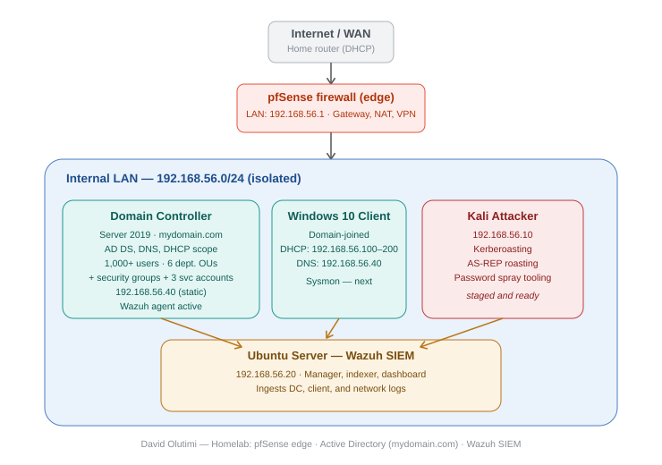

# Multi-Layer Network & Security Homelab

A self-built simulation of a corporate network — firewall, Active Directory domain, SIEM, and cloud log forwarding — designed to practice enterprise security operations, detection engineering, and incident investigation end-to-end.

---

## Overview

As a Computer Science student, I found it difficult to gain hands-on cybersecurity experience without a real environment to practice in. Rather than wait for that experience to come from a job, I built it myself, starting from a simple two-machine attacker/defender setup and expanding it into a realistic, segmented network once I recognized that real environments involve many interconnected systems, not just one attacker and one target.

This repository documents the full build: architecture decisions, configuration, detections, and the real troubleshooting encountered along the way.

## Architecture

| Component | Role |
|---|---|
| **pfSense** | Network edge — firewall, NAT, routing, VLAN segmentation |
| **Windows Server 2019 (DC)** | Active Directory Domain Services, DNS, DHCP — `mydomain.com` |
| **Windows 10 Client** | Domain-joined endpoint, Sysmon-instrumented |
| **Kali Linux** | Attacker machine — Nmap, Hydra, Kerberoasting, password spray tooling |
| **Ubuntu Server (Wazuh)** | SIEM — manager, indexer, dashboard; ingests logs from every host |
| **Microsoft Azure** | Log Analytics Workspace + Sentinel — cloud log forwarding and KQL analysis |

**Design decision:** pfSense sits at the network edge and performs NAT/routing, rather than the domain controller doing double duty as router — this mirrors how a real enterprise separates edge security from directory services, and keeps the firewall/VLAN segmentation story central to the lab.

## Components Built

### 1. Network Foundation
- Segmented internal LAN (`172.16.0.0/24`) behind a pfSense firewall
- Firewall rules and VLAN configuration
- Isolated from host network — safe to attack without risk

### 2. Active Directory Domain
- Windows Server 2019 promoted to Domain Controller — domain: `mydomain.com`
- AD DS, DNS, and DHCP scope hosted on the DC
- PowerShell-scripted bulk user provisioning — **1,000+ accounts** across 6 departments (IT, Finance, HR, Sales, Marketing, Engineering), each with a matching security group
- Windows 10 client domain-joined *(Sysmon deployment next)*

### 3. SIEM & Detection
- Wazuh deployed on Ubuntu, ingesting logs from DC, client, and network layer
- Sysmon configured for high-fidelity process, network, and registry telemetry
- Detections validated against controlled attacks (reconnaissance, brute-force — **145 alerts confirmed** across network, host, and SIEM layers)

### 4. Cloud Integration
- Logs forwarded to Azure Log Analytics Workspace
- Microsoft Sentinel dashboard built with KQL queries
- Alert triage and IOC analysis mapped to MITRE ATT&CK

### 5. Attack Simulation *(staged, not yet executed)*
- Kali Linux positioned on the internal network with Kerberoasting, AS-REP roasting, and password spray tooling ready
- Next step: run each technique against the domain and document what fires in Wazuh — event IDs, what's noise, what's signal, and any tuning required

<!--
FILL IN ONCE THE ATTACK IS RUN — replace the block above with:

### 5. Attack Simulation — Kerberoasting
- Enumerated Kerberoastable service accounts via [tool], requested service tickets, cracked offline with hashcat (mode 13100)
- Detected via [Event ID 4769 / Wazuh rule ID], correlated with [encryption type / request volume] as the key indicator
- False positives encountered: [describe, or "none"]
- Tuning applied: [describe]
- Full incident report: [link to INCIDENT_REPORT.md or /reports folder]

## Incident Reports

*(Add once complete — one line per report, linking to the full writeup)*
- [ ] Kerberoasting against seeded service accounts — [link]

## Build Log & Troubleshooting

Real problems encountered and resolved during the build — kept here because the debugging process is as valuable as the working result.

| Issue | Root Cause | Resolution |
|---|---|---|
| Ubuntu static IP reverting on reboot | NetPlan and NetworkManager both active, NetworkManager overriding config | Deactivated NetworkManager, standardized on NetPlan, full reset |
| Windows Server VM freezing at loading screen during install | 64-bit guest requires PAE/NX, which was disabled; VirtualBox's default Hyper-V-style paravirtualization interface was incompatible with a very new AMD CPU generation | Enabled PAE/NX (Processor tab) and switched Paravirtualization Interface from Default to KVM (Acceleration tab) |
| PowerShell bulk-user script — interactive "Supply values for Name" prompt on every user | Backtick line-continuation broke silently due to invisible trailing whitespace, fragmenting the `New-ADUser` command | Replaced backtick continuation with parameter splatting (`$params = @{...}; New-ADUser @params`) — eliminates this entire bug class |
| PowerShell script — "SearchBase" type conversion error | `([ADSI]"").distinguishedName` returns a non-string ADSI object type; direct parameter binding rejected it while string interpolation elsewhere silently worked | Explicitly cast with `.ToString()` at the point of assignment |
-->
## Skills Demonstrated

`Network segmentation` `Firewall configuration` `Active Directory administration` `DNS/DHCP` `PowerShell automation` `SIEM deployment & tuning` `Sysmon configuration` `Cloud log forwarding` `KQL` `MITRE ATT&CK mapping` `Systematic troubleshooting`

## What I Learned

Building the environment was only half the value. The real skill developed here was learning to explain what I found clearly — translating a technical event into something a non-technical stakeholder could act on. That's what pulled me toward the risk and communication side of security, not just the technical execution.

## Future Improvements

- [ ] Complete AD domain build and resolve current VM boot issue
- [ ] Run and document full attack chain (Kerberoasting, AS-REP roast, password spray)
- [ ] Write Sigma detection rules for each attack technique, with tuning notes
- [ ] Add a second Windows client for lateral movement scenarios
- [ ] Purple team exercise — Atomic Red Team vs. current detection coverage

---

*Built and documented by David Olutimi — [LinkedIn](https://www.linkedin.com/in/david-olutimi/) · [Portfolio](#)*
