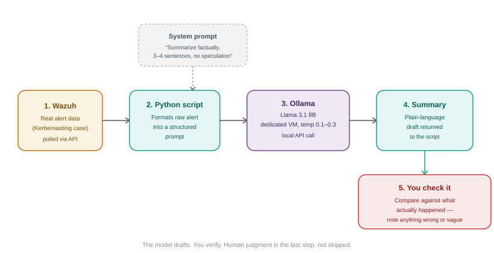

# AI Alert Triage Assistant

<em>A small, self-hosted tool that pulls real security events from my homelab and asks a local LLM to draft a plain-language summary, with a human checking the result against what actually happened. Part of the larger <a href="../">cybersecurity-homelab</a> project.</em>

## Why

I finished TCM Security's AI Fundamentals course. I wanted to apply it to something real rather than a toy dataset: could a self-hosted model turn a raw Windows Security event into a summary a non-technical reader could understand, without inventing anything that isn't in the data?

## Architecture

Wazuh/Windows event data → Python script → Ollama (Llama 3.1 8B, local, low temperature) → plain-language summary → human verification against the known facts of the case.

## The decision

Running everything locally, on the host machine, was a deliberate choice. An earlier attempt to stand up a dedicated Ubuntu VM for Ollama hit repeated setup friction, and since this is a single-user prototype with no need for isolation, running it directly on the host let the project actually get built instead of stalling on infrastructure.

## What I did

Wrote a Python script (`summarize_alert.py`) that loads a saved security event (or an array of events), sends it to a locally running Llama 3.1 8B model via Ollama's API with a system prompt constraining it to the supplied data, and prints the result.

## Test case

The input is five real Event ID 4769 entries from my own Active Directory lab, generated during the Kerberoasting investigation, service ticket requests for `svc-sql` from the `jdoe` account, spanning August 7 to August 29. (see `alert.json`)

## What the first version got wrong

<table>
<tr>
<td>
The first system prompt produced a technically accurate but materially incomplete summary. It described the requests as happening "multiple times" on "different dates" instead of stating the actual count (5) or date range, and it never mentioned the Kerberos ticket encryption type at all, even though that field (<code>0x17</code>, RC4) was present in every event it was given.
  
That omission matters specifically because of what the encryption type meant in my original Kerberoasting investigation: it's the detail that determines whether a classic "look for RC4" detection signal would even apply. A summarization tool that silently drops the one field an analyst would check is a real limitation.
</td>
</tr>
</table>

**Actual v1 output:**
> A user named "jdoe" with the account name "jdoe@MYDOMAIN.COM" has requested a Kerberos service ticket to access a Windows service named "svc-sql" multiple times. The requests were made from the IP address "::ffff:192.168.56.101" on different dates and times. The requests were all successful, as indicated by a failure code of 0x0. The service ticket requests can be correlated with Windows logon events by comparing the Logon GUID fields in each event.

## The fix

The system prompt was rewritten to explicitly require: the exact event count when more than one is present, the account and service involved, the encryption type stated by name for every event, and an explicit (non-verdict) flag on whether the pattern is worth human review. The updated prompt is in `summarize_alert.py`.

**Actual v2 output, same `alert.json`, same five events:**
> **Count and Date Range:** 5 events, spanning from August 7, 2026, to August 29, 2026.
>
> **Account and Service Involved:** The account "jdoe@MYDOMAIN.COM" is requesting access to the service "svc-sql".
>
> **Kerberos Ticket Encryption Type:** All 5 events have a Kerberos ticket encryption type of "RC4" (0x17).
>
> **Pattern:** The same account and service are involved in all 5 events, and the events are spread across a short period of time. This pattern may be something a human analyst should review to determine if it is a legitimate activity or a potential security issue.

**Status: confirmed.** All four requirements landed correctly on the first real run: the exact count, the full date range, the encryption type named rather than left as a hex code, and a pattern flag that stops short of declaring a verdict itself. Compare this directly against the v1 output above, same input data, meaningfully different output.

## A pattern worth naming

This is the third time, across three different tools, that I've found the same underlying shape of problem: a system had the correct data the whole time, but didn't surface the one detail that actually mattered. Wazuh had the Kerberoasting events but no default rule named the technique. Sentinel had the same events but no default analytic rule either. Now this summarizer had the encryption type in every event and left it out of the summary by default. Different mechanisms each time, same lesson: having the data is not the same as surfacing what matters, whether the "analyst" is a SIEM's ruleset or an LLM's system prompt.

## What's not done

No Wazuh API integration yet; the script currently reads from a saved file, not a live alert feed. No evaluation beyond this single test case, so it's confirmed working on one five-event array, not proven across varied inputs.

## What this enables

A reusable pattern for turning raw security telemetry from this homelab into readable summaries, and a second, concrete example (beyond the SIEM detection-gap findings) of why "the AI said so" is never sufficient on its own; every output here gets checked against the actual event data before being trusted.
